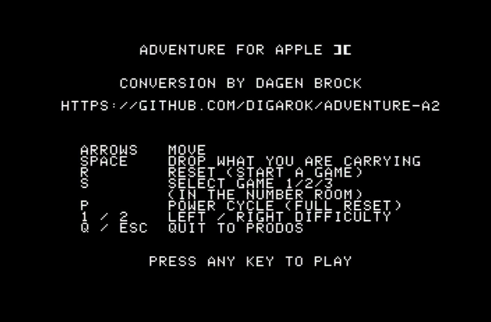
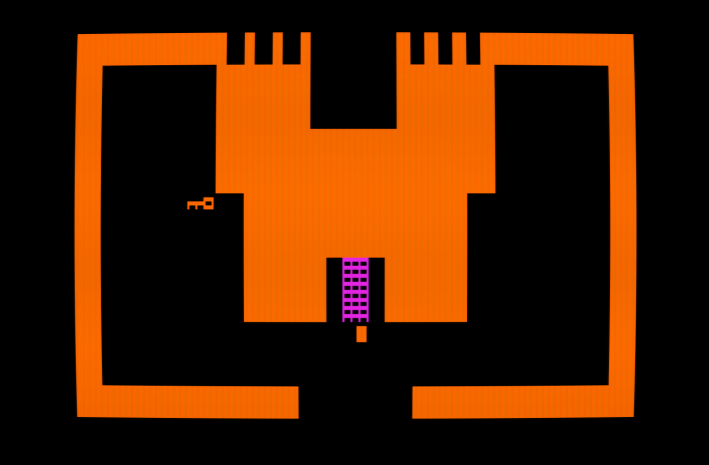
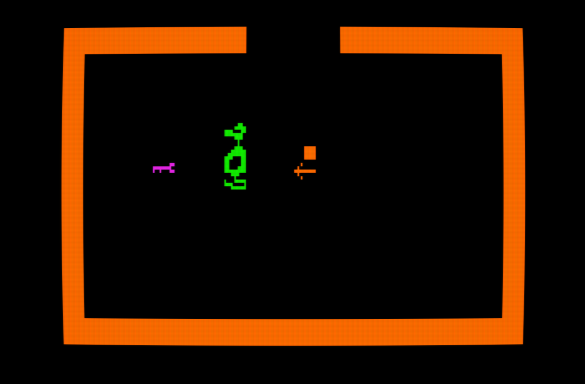
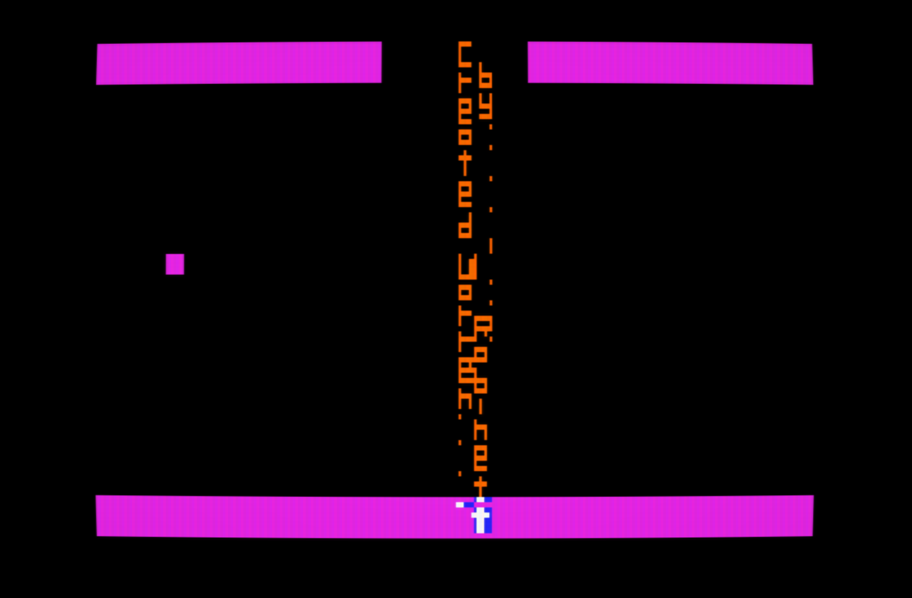

ADVENTURE A2 - a port of Atari 2600 Adventure (Warren Robinett, 1979)
to the Apple II, from the published 6502 disassembly.

The game logic is the original 6502 code, ported line for line.  Only
three things are replaced: the TIA display kernel (a HGR renderer), the
TIA collision latches (computed in software from the same sprite and
playfield data), and the console switches / joystick (the keyboard).

A title screen lists the keys; any key starts the game.

Controls:
  Arrow keys    move
  Space         drop the object you are carrying
  R             reset (start a game)
  S             select game 1/2/3 (only in the number room)
  1 / 2         toggle the left / right difficulty switches
  Q or Esc      quit to ProDOS

Runs at the original 20 ticks per second on a 1 MHz Apple II.

Sound: the 2600 sets three TIA registers once a tick (a waveform, a
frequency divider and a volume) and lets the chip run.  The Apple II
plays the same 1-bit TIA waveform on its speaker, at the same pitch,
with the volume rendered as pulse width (src/a2/sound.s; tables from
tools/tiasnd.py, which also renders the sounds to WAV for comparison).
The speaker has to be driven by the CPU, so the game runs at about
half speed while a sound plays.  On a IIgs the driver drops to 1 MHz
for the duration.

Winning plays a tune of its own (src/a2/wintune.s): two square-wave
voices mixed on the speaker, played straight through before the
game-over flash carries on.  The notes live in tools/wintune.py, which
generates the song data and can render the tune to WAV.

Building and running (from the repo):
  make a2          assemble and build build/adventure.po (140K, bootable)
  make run-a2      build, then launch it in GSplus
